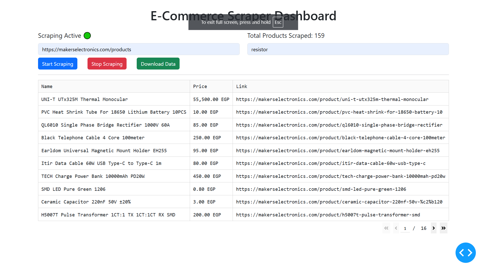

# E-Commerce Scraper with Dash UI

## Description
This project is a General Purpose full-stack web scraper for Multi e-commerce websites built with Playwright and Dash. The Dash app allows users to:
- Start, pause, and stop scraping
- Specify a shop URL and optional search keywords
- View scraped data in real-time
- Download the scraped data as an Excel file

## Screenshots



## Installation

1. Clone this repository:
   ```bash
   git clone <repository_link>
   cd ecommerce_scraper_dash
   ```

2. Install dependencies:
   ```bash
   pip install -r requirements.txt
   playwright install
   ```

3. Run the Dash app:
   ```bash
   python app.py
   ```

## Usage
- Enter the e-commerce website URL and optional search keywords.
- Click "Start Scraping" to begin data extraction.
- Click "Stop Scraping" to halt the process.
- Click "Download Data" to save the scraped data as a CSV file.

